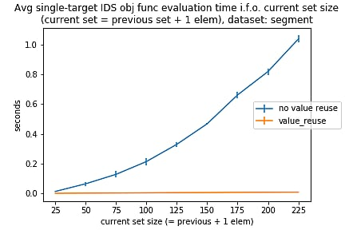

# Unconstrained Submodular Maximization

A collection of optimization algorithms for Unconstrained Submodular Maximization (USM) of non-monotone non-negative set functions.
 
 Maximizing a non-monotone submodular function is NP-hard. This means there is no guarantee an optimal solution can be found within a polynomial number of function evaluations.  As maximization is NP-hard, finding a 'maximum' is often done using approximation algorithms resulting in an approximate solution. This repository contains Python implementations of a couple of optimization algorithms tackling USM. 

## Table of Contents

* [Basic example](https://github.com/joschout/SubmodularMaximization#basic-example)
* [Installation](https://github.com/joschout/SubmodularMaximization#installing-submodmax)
* [Included submodular maximization algorithms](https://github.com/joschout/SubmodularMaximization#included-submodular-maximization-algorithms)
* [Usage](https://github.com/joschout/SubmodularMaximization#usage)
    * [The submodular function to be maximized](https://github.com/joschout/SubmodularMaximization#the-submodular-function-to-be-maximized)
        * [General submodular functions - evaluation without function value reuse](https://github.com/joschout/SubmodularMaximization#general-submodular-functions---evaluation-without-function-value-reuse)
        * [Speeding up submodular functions evaluation with function value reuse](https://github.com/joschout/SubmodularMaximization#speeding-up-submodular-functions-evaluation-with-function-value-reuse)
        * [Defining your own submodular function](https://github.com/joschout/SubmodularMaximization#defining-your-own-submodular-function)
    * [The optimizers](https://github.com/joschout/SubmodularMaximization#the-optimizers)
    
* [Reason behind this repo](https://github.com/joschout/SubmodularMaximization#reason-behind-this-repository)
* [References](https://github.com/joschout/SubmodularMaximization#references)

## Basic example

As a minimal example, we can use the simple submodular function used in Andreas Krause's great [tutorial slides at www.submodularity.org](https://las.inf.ethz.ch/submodularity/). This function defines the following mapping:

| input_set | output |
|-----------|--------|
| {}        | 0      |
| {1}       | -1     |
| {2}       | 2      |
| {1, 2}    | 0      |

Here, the **ground set** of interest is defined as: `{ 1, 2 }`. Thus, the goal is to find the subset of this ground set that maximizes the submodular function. In this case, the optimal solution is `{2}` Here, we can do this as follows:

```python
from typing import Set, TypeVar

from submodmax.abstract_optimizer import AbstractSubmodularFunction, AbstractOptimizer
from submodmax.randomized_double_greedy_search import RandomizedDoubleGreedySearch

E = TypeVar('E')

# Define the submodular function to maximize
class ExampleFunction(AbstractSubmodularFunction):
    def evaluate(self, input_set: Set[int]) -> float:
        if input_set == set():
            return 0
        elif input_set == {1}:
            return -1
        elif input_set == {2}:
            return 2
        elif input_set == {1, 2}:
            return 0
        else:
            raise Exception(f"The input set was not expected: {input_set}")

# Intialize the submodular function
submodular_objective_function = ExampleFunction()

# -------------
# Define the ground set
ground_set: Set[int] = {1, 2}

# Choose an optimization algorithm
#   and initialize it with:
#   * the submodular function 
#   * the ground set
optimizer: AbstractOptimizer = RandomizedDoubleGreedySearch(
    objective_function=submodular_objective_function,
    ground_set=ground_set,
    debug=False
)

# Run the optimization algorithm to get a solution
local_optimum: Set[int] = optimizer.optimize()
true_optimum: Set[int] = {2}
print(local_optimum)
if true_optimum == local_optimum:
    print(f"Found correct local optimum: {local_optimum}")
else:
    print(f"Found {local_optimum}, but should be {true_optimum}")

```

## Installation

You can install this repositiory as a python package in a Python 3.6+ environment as follows:

```bash
git clone https://github.com/joschout/SubmodularMaximization.git
cd SubmodularMaximization/
python setup.py install develop [--user]
```

To use it in your project, you can use:
``` Python 
from submodmax import <what-you-need>
```

## Included submodular maximization algorithms

First, this repository includes the three algorithms proposed by Feige, U., Mirrokni, V. S., and Vondrák, J. in their paper:

> Feige, U., Mirrokni, V. S., & Vondrák, J. (2011). Maximizing Non-monotone Submodular Functions. SIAM J. Comput., 40(4), 1133–1153. https://doi.org/10.1137/090779346

These algorithms are called:
* Random Set
* Deterministic Local Search
* Smooth Local Search

Next, this repository contains two of the algorithms propsed by Buchbinder, N., Feldman, M., Naor, J. S., and Schwartz, R. in their paper:

> Buchbinder, N., Feldman, M., Naor, J. S., & Schwartz, R. (2015). A tight linear time (1/2)-approximation for unconstrained submodular maximization. SIAM Journal on Computing, 44(5), 1384–1402. https://doi.org/10.1137/130929205

For a lack of a better name, this repository calls these algorithms:
* Deterministic Double Greedy Search (Deterministic USM in the original paper)
* Randomized Double Greedy Search (Randomized USM in the original paper)

## Usage

The following describes how to use this repository in your own implementation.

### The submodular function to be maximized

A submodular function can be represented as an object of a class implementing one of two interfaces, depending on whether the maximization algorithm can use marginal increments to speed things up:

1. General submodular functions should implement the [`AbstractSubmodularFunction` interface](./submodmax/abstract_optimizer.py).
2. Submodular functions for which the maximization algorithm only computes marginal increments, for which we can use a computational trick to speed things up. I.e., if the submodular objective function is sequentially evaluated, we might only need to take into account the difference between the sets between two consecutive evaluations, and update the previous function value using this information. In this package, we refer to this as **function value reuse**. These submodular functions should implement the [`AbstractSubmodularFunctionValueReuse` interface](submodmax/value_reuse/abstract_optimizer.py).

#### General submodular functions - evaluation without function value reuse
Without function value reuse, submodular functions can be implemented similar to the [basic example](https://github.com/joschout/SubmodularMaximization#basic-example), which can also be found in [./examples/example_Andreas_Krause.py](./examples/example_Andreas_Krause.py)

More specifically, the submodular function to be maximized should be contained in an object of a class inheriting from `AbstractSubmodularFunction`. This class looks as follows:
``` Python 
class AbstractSubmodularFunction:
    def evaluate(self, input_set: Set[E]) -> float:
        raise NotImplementedError('Abstract Method')
```
That is, `AbstractSubmodularFunction` requires its subclasses to implement an `evaluate()` method, taking as input a `Set[E]` and resulting in a `float`. This method should evaluate the set function on the given set, returning the value of the function. This class corresponds to the *'value oracle'*, which should be able to return the value of the function to be maximized for every possible subset of the *ground set*.

Typically, your own class inheriting `AbstractSubmodularFunction` can contain instance variables for parameters required by the objective function.


#### Speeding up submodular functions evaluation with function value reuse

Submodular optimization often corresponds to repeated evaluation of the function to be optimized, using different sets as input. Evaluating the function can be costly: the computational effort is often a function of the elements in the set. However, some optimization algorithms (such as Buchbinder's Greedy Search) sequentially evaluate the submodular function on input sets where two consecutive input sets do not differ much. Often, only one element is added or removed at a time. For such functions, it is sometimes possible to reuse the function value obtained from the previous evaluation, and update it with the difference corresponding to the changed set. This difference is called the **marginal increment**. This trick is also used in [Andreas Krause's SFO toolbox](https://las.inf.ethz.ch/sfo/index.html), [as described in](https://www.jmlr.org/papers/volume11/krause10a/krause10a.pdf):
> Krause, Andreas. "SFO: A toolbox for submodular function optimization." The Journal of Machine Learning Research 11 (2010): 1141-1144. 

Using marginal increments to update the previous function value can drastically reduce the work, compared to re-evaluating the function on the whole input set.

The following example plot shows the evaluation time for the Interpretable Decision Set objective function, for gradually larger input sets. Here, the evaluation time in function of the input set size improves dramatically when the function value of the previous evaluation is reused and updated with the marginal increment, compared to the evaluation time of recomputing the function on the whole input set.



#### Defining your own submodular function

To use this package in your own code, you can have a look at the basic example in [./examples/value_reuse/example_Andreas_Krause.py](./examples/value_reuse/example_Andreas_Krause.py). More specifically, the submodular function to be maximized should be contained in an object of a class inheriting from `AbstractSubmodularFunctionValueReuse`. This class looks as follows:
``` Python 
class AbstractSubmodularFunctionValueReuse:
    def evaluate(self, current_set_info: SetInfo,
                 previous_func_info: Optional[FuncInfo],
                 ) -> FuncInfo:
        raise NotImplementedError('abstract method')
```

### The Optimizers
Every included optimizer inherits the class `AbstractOptimizer` (or `AbstractSubmodularFunctionValueReuse`). Each optimizer should be initialized with at least two arguments:
1. the objective function to be optimized
2. the ground set of items. The optimizers will search over the power set of this ground set.

The following shows the definition of the `AbstractOptimizer` class:

``` Python
class AbstractOptimizer:
    def __init__(self, objective_function: AbstractSubmodularFunction, ground_set: Set[E], debug: bool = True):
        self.objective_function: AbstractSubmodularFunction = objective_function
        self.ground_set: Set[E] = ground_set
        self.debug: bool = debug

    def optimize(self) -> Set[E]:
        raise NotImplementedError("abstract method")
```


## Reason behind this repository

This repository came into being while experimenting with the Interpretable Decision Sets algorithm (IDS), as proposed by Lakkaraju, Bach and Leskovec in

> Lakkaraju, H., Bach, S. H., & Leskovec, J. (2016). Interpretable Decision Sets: A Joint Framework for Description and Prediction. In Proceedings of the 22Nd ACM SIGKDD International Conference on Knowledge Discovery and Data Mining (pp. 1675–1684). New York, NY, USA: ACM. https://doi.org/10.1145/2939672.2939874

[The IDS implementation associated with the original IDS paper can be found here.](https://github.com/lvhimabindu) It is limited in the fact that it includes code to learn an IDS model, but no code to actually apply the model, and no code to replicated the experiments from the paper. A great re-implementation of IDS by Jiri Filip and Tomas Kliegr called [PyIDS can be found here](https://github.com/jirifilip/pyIDS), and is described in

> Jiri Filip, Tomas Kliegr. PyIDS - Python Implementation of Interpretable Decision Sets Algorithm by Lakkaraju et al, 2016. RuleML+RR2019@Rule Challenge 2019. http://ceur-ws.org/Vol-2438/paper8.pdf

PyIDS re-implements IDS from scratch, making it more efficient and adding functionality missing in the original implementation, and some more benefits on top.

IDS learns a classification model by maximizing an unconstrained non-monotone non-negative submodular set function. The original IDS source code and PyIDS contain three optimization algorithms that can be used for USM:

* Random Set
* Deterministic Local Search
* Smooth Local Search

However, these implementations were tightly integrated with their respective IDS implementations. The code in this repository is both based on the original paper proposing the algorithms by Feige et al., and the implementations of Lakkaraju et al. and Filip et al. It decouples the optimization procedures from IDS, and contains versions that are largely rewritten from scratch, trying to make each algorithm more readable and extendable.


## References

The papers proposing the algorithms in this repository:

> Feige, U., Mirrokni, V. S., & Vondrák, J. (2011). Maximizing Non-monotone Submodular Functions. SIAM J. Comput., 40(4), 1133–1153. https://doi.org/10.1137/090779346
> 
> Buchbinder, N., Feldman, M., Naor, J. S., & Schwartz, R. (2015). A tight linear time (1/2)-approximation for unconstrained submodular maximization. SIAM Journal on Computing, 44(5), 1384–1402. https://doi.org/10.1137/130929205

Some good references for submodular maximization
> Krause, A., & Golovin, D. (2011). Submodular function maximization. Tractability, 9781107025, 71–104. https://doi.org/10.1017/CBO9781139177801.004
> 
> Bach, F. (2013). Learning with submodular functions: A convex optimization perspective. Foundations and Trends in Machine Learning, 6(2–3), 145–373. https://doi.org/10.1561/2200000039
> 
> Badanidiyuru, A., & Vondrák, J. (2014). Fast algorithms for maximizing submodular functions. Proceedings of the Annual ACM-SIAM Symposium on Discrete Algorithms, 1497–1514.
> Buchbinder, N., & Feldman, M. (2018). Deterministic Algorithms for Submodular Maximization. ACM Transactions on Algorithms, 14(3).
> 
> Buchbinder, N., & Feldman, M. (2019). Submodular Functions Maximization Problems. Handbook of Approximation Algorithms and Metaheuristics, Second Edition, 753–788. https://doi.org/10.1201/9781351236423-42

Andreas Krause and Carlos Guestrin maintain a [great website about submodular optimization and the submodularity property](https://las.inf.ethz.ch/submodularity/), linking to their [Matlab/Octave toolbox for Submodular Function Optimization](https://las.inf.ethz.ch/sfo/index.html).

Jan Vondrak hosts the [slides for some great presentations he did about submodular functions on his website.](https://theory.stanford.edu/~jvondrak/presentations.html)

References for the Interpretable Decision Set algorithm:

> Lakkaraju, H., Bach, S. H., & Leskovec, J. (2016). Interpretable Decision Sets: A Joint Framework for Description and Prediction. In Proceedings of the 22Nd ACM SIGKDD International Conference on Knowledge Discovery and Data Mining (pp. 1675–1684). New York, NY, USA: ACM. https://doi.org/10.1145/2939672.2939874
> 
> Jiri Filip, Tomas Kliegr. PyIDS - Python Implementation of Interpretable Decision Sets Algorithm by Lakkaraju et al, 2016. RuleML+RR2019@Rule Challenge 2019. http://ceur-ws.org/Vol-2438/paper8.pdf
